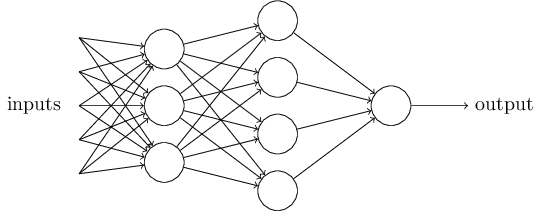
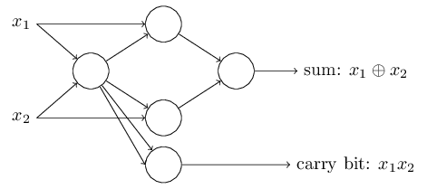
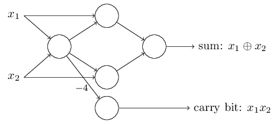
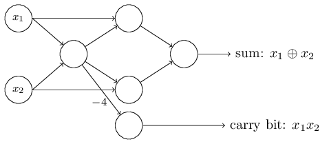
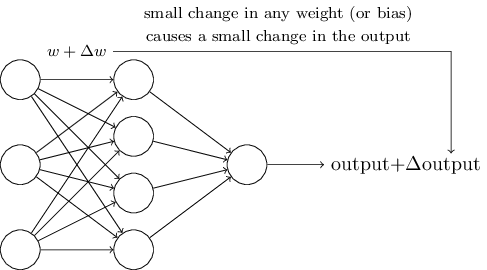
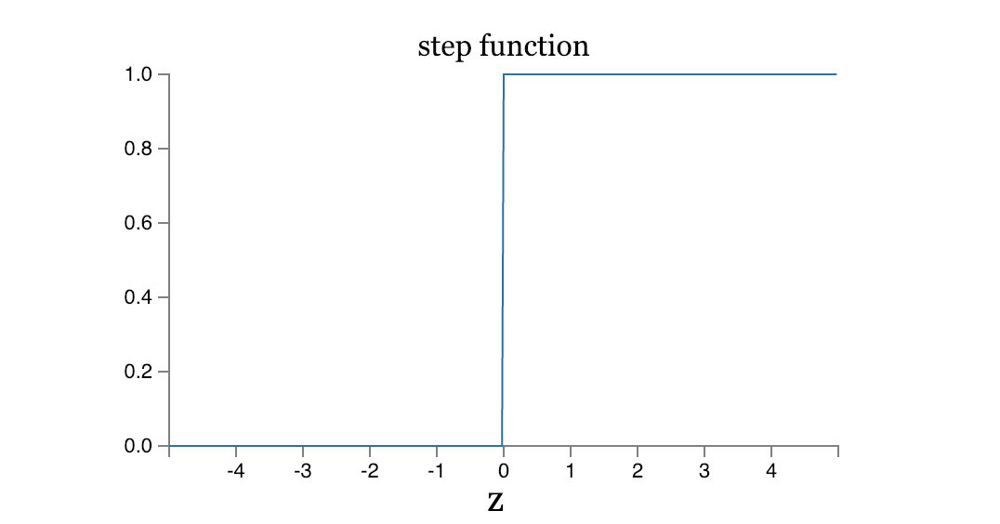

# 第1章 使用神经网络识别手写数字
The human visual system is one of the wonders of the world. Consider the following sequence of handwritten digits:

人类视觉系统是世界奇迹之一。考虑以下手写数字序列：

Most people effortlessly recognize those digits as 504192. That ease is deceptive. In each hemisphere of our brain, humans have a primary visual cortex, also known as V1, containing 140 million neurons, with tens of billions of connections between them. And yet human vision involves not just V1, but an entire series of visual cortices - V2, V3, V4, and V5 - doing progressively more complex image processing. We carry in our heads a supercomputer, tuned by evolution over hundreds of millions of years, and superbly adapted to understand the visual world. Recognizing handwritten digits isn't easy. Rather, we humans are stupendously, astoundingly good at making sense of what our eyes show us. But nearly all that work is done unconsciously. And so we don't usually appreciate how tough a problem our visual systems solve.

大多数人毫不费力地将这些数字识别为504192。这种容易性具有欺骗性。在我们大脑的每个半球，人类都有一个初级视觉皮层，也称为V1，含有1.4亿个神经元，它们之间有数百亿个连接。然而，人类视觉不仅涉及V1，还涉及整个系列的视觉皮层--V2，V3，V4和V5 - 逐步进行更复杂的图像处理。我们的头脑是一台超级计算机，经过数亿年的演变调整，并且非常适应了解视觉世界。识别手写数字并不容易。相反，我们人类是惊人的，非常善于理解我们的眼睛向我们展示的东西。但几乎所有这些工作都是在无意识中完成的。因此，我们通常不会理解视觉系统解决问题的难度。

The difficulty of visual pattern recognition becomes apparent if you attempt to write a computer program to recognize digits like those above. What seems easy when we do it ourselves suddenly becomes extremely difficult. Simple intuitions about how we recognize shapes - "a 9 has a loop at the top, and a vertical stroke in the bottom right" - turn out to be not so simple to express algorithmically. When you try to make such rules precise, you quickly get lost in a morass of exceptions and caveats and special cases. It seems hopeless.

如果您尝试编写计算机程序来识别上述数字，那么视觉模式识别的难度就会变得很明显。当我们自己做的时候看起来很容易变得非常困难。关于我们如何识别形状的简单直觉 - “一个9在顶部有一个环，一个在右下方有一个垂直笔划” - 结果并不是那么简单的算法表达。当你试图使这些规则变得精确时，你很快就会陷入异常和警告以及特殊情况。这似乎毫无希望。

Neural networks approach the problem in a different way. The idea is to take a large number of handwritten digits, known as training examples,

神经网络以不同的方式解决问题。我们的想法是采用大量手写数字，称为训练样例，

and then develop a system which can learn from those training examples. In other words, the neural network uses the examples to automatically infer rules for recognizing handwritten digits. Furthermore, by increasing the number of training examples, the network can learn more about handwriting, and so improve its accuracy. So while I've shown just 100 training digits above, perhaps we could build a better handwriting recognizer by using thousands or even millions or billions of training examples.

然后开发一个可以从这些训练样例中学习的系统。换句话说，神经网络使用示例来自动推断用于识别手写数字的规则。此外，通过增加训练样本的数量，网络可以更多地了解手写，从而提高其准确性。因此，虽然我上面只显示了100个训练数字，但也许我们可以通过使用数千甚至数百万或数十亿的训练样例来构建更好的手写识别器。

In this chapter we'll write a computer program implementing a neural network that learns to recognize handwritten digits. The program is just 74 lines long, and uses no special neural network libraries. But this short program can recognize digits with an accuracy over 96 percent, without human intervention. Furthermore, in later chapters we'll develop ideas which can improve accuracy to over 99 percent. In fact, the best commercial neural networks are now so good that they are used by banks to process cheques, and by post offices to recognize addresses.

在本章中，我们将编写一个计算机程序，实现一个学习识别手写数字的神经网络。该程序只有74行，并没有使用特殊的神经网络库。但是这个简短的程序可以识别精度超过96％的数字，无需人工干预。此外，在后面的章节中，我们将开发出可以将准确度提高到99％以上的想法。实际上，最好的商业神经网络现在非常好，银行可以使用它们来处理支票，并通过邮局来识别地址。

We're focusing on handwriting recognition because it's an excellent prototype problem for learning about neural networks in general. As a prototype it hits a sweet spot: it's challenging - it's no small feat to recognize handwritten digits - but it's not so difficult as to require an extremely complicated solution, or tremendous computational power. Furthermore, it's a great way to develop more advanced techniques, such as deep learning. And so throughout the book we'll return repeatedly to the problem of handwriting recognition. Later in the book, we'll discuss how these ideas may be applied to other problems in computer vision, and also in speech, natural language processing, and other domains.

我们专注于手写识别，因为它是学习神经网络的一个很好的原型问题。作为原型，它有一个最佳点：它具有挑战性 - 识别手写数字并不是一件小事 - 但要求极其复杂的解决方案或巨大的计算能力并不困难。此外，它是开发更高级技术的好方法，例如深度学习。因此，在整本书中，我们将反复回到手写识别问题。在本书的后面，我们将讨论这些想法如何应用于计算机视觉中的其他问题，以及语音，自然语言处理和其他领域。

Of course, if the point of the chapter was only to write a computer program to recognize handwritten digits, then the chapter would be much shorter! But along the way we'll develop many key ideas about neural networks, including two important types of artificial neuron (the perceptron and the sigmoid neuron), and the standard learning algorithm for neural networks, known as stochastic gradient descent. Throughout, I focus on explaining why things are done the way they are, and on building your neural networks intuition. That requires a lengthier discussion than if I just presented the basic mechanics of what's going on, but it's worth it for the deeper understanding you'll attain. Amongst the payoffs, by the end of the chapter we'll be in position to understand what deep learning is, and why it matters.

当然，如果本章的目的只是编写一个识别手写数字的计算机程序，那么这一章就会短得多！但在此过程中，我们将开发许多关于神经网络的关键思想，包括两种重要类型的人工神经元（感知器和乙状结肠神经元），以及神经网络的标准学习算法，称为随机梯度下降。在整个过程中，我专注于解释为什么事情以他们的方式完成，以及建立你的神经网络直觉。这需要更长时间的讨论，而不是我刚刚介绍了正在发生的事情的基本机制，但是对于你将获得更深刻的理解是值得的。在收益中，到本章结尾，我们将能够理解深度学习是什么。

## Perceptrons 感知器
What is a neural network? To get started, I'll explain a type of artificial neuron called a perceptron. Perceptrons were developed in the 1950s and 1960s by the scientist Frank Rosenblatt, inspired by earlier work by Warren McCulloch and Walter Pitts. Today, it's more common to use other models of artificial neurons - in this book, and in much modern work on neural networks, the main neuron model used is one called the sigmoid neuron. We'll get to sigmoid neurons shortly. But to understand why sigmoid neurons are defined the way they are, it's worth taking the time to first understand perceptrons.

什么是神经网络？首先，我将解释一种称为感知器的人工神经元。感知器是 由科学家弗兰克罗森布拉特在20世纪50年代和60年代开发的 ，受到沃伦麦卡洛克和 沃尔特皮茨的早期工作 的启发 。今天，使用其他模型的人工神经元更为常见 - 在本书中，在神经网络的许多现代工作中，使用的主要神经元模型是一个称为S形神经元的模型 。我们很快就会得到sigmoid神经​​元。但要理解为什么乙状结肠神经元的定义方式如此，值得花时间先了解感知器。

So how do perceptrons work? A perceptron takes several binary inputs, x1,x2,…

那么感知器如何工作呢？感知器需要几个二进制输入 x1，x2，...，并生成一个二进制输出：

In the example shown the perceptron has three inputs, x1,x2,x3. In general it could have more or fewer inputs. Rosenblatt proposed a simple rule to compute the output. He introduced weights, w1,w2,…, real numbers expressing the importance of the respective inputs to the output. The neuron's output, 0 or 1, is determined by whether the weighted sum ∑w_jx_j is less than or greater than some threshold value. Just like the weights, the threshold is a real number which is a parameter of the neuron. To put it in more precise algebraic terms:

在所示的示例中，感知器有三个输入x1，x2，x3。一般来说，它可能有更多或更少的输入。罗森布拉特提出了一个计算输出的简单规则。他介绍了*权重*，w1，w2，...，实数表示各输入对输出的重要性。神经元的输出，0或1，是由加权和 ∑w_jx_j 小于或大于某个阈值决定的。就像权重一样，阈值是一个实数，它是神经元的参数。用更精确的代数术语来表达它：

That's all there is to how a perceptron works!

这就是感知器的工作方式！

That's the basic mathematical model. A way you can think about the perceptron is that it's a device that makes decisions by weighing up evidence. Let me give an example. It's not a very realistic example, but it's easy to understand, and we'll soon get to more realistic examples. Suppose the weekend is coming up, and you've heard that there's going to be a cheese festival in your city. You like cheese, and are trying to decide whether or not to go to the festival. You might make your decision by weighing up three factors:

这是基本的数学模型。您可以考虑感知器的一种方式是，它是一种通过权衡证据来做出决策的设备。让我举个例子。这不是一个非常现实的例子，但它很容易理解，我们很快就会得到更实际的例子。假设周末即将来临，你已经听说你所在城市将举办奶酪节。你喜欢奶酪，并试图决定是否去参加电影节。您可以通过权衡三个因素来做出决定：

- Is the weather good?
- Does your boyfriend or girlfriend want to accompany you?
- Is the festival near public transit? (You don't own a car).

- 天气好吗？
- 你的男朋友或女朋友想陪你吗？
- 公共交通附近有节日吗？（你没有车）。

We can represent these three factors by corresponding binary variables x1,x2, and x3. For instance, we'd have x1=1 if the weather is good, and x1=0 if the weather is bad. Similarly, x2=1 if your boyfriend or girlfriend wants to go, and x2=0 if not. And similarly again for x3 and public transit.

我们可以通过相应的二元变量x来表示这三个因子 1，x2和x3。例如，我们有x1= 1如果天气好的话，和x1= 0如果天气不好 同样，x2= 1如果你的男朋友或女朋友想去，和x2= 0如果不。并且类似地再次为x3 和公共交通。

Now, suppose you absolutely adore cheese, so much so that you're happy to go to the festival even if your boyfriend or girlfriend is uninterested and the festival is hard to get to. But perhaps you really loathe bad weather, and there's no way you'd go to the festival if the weather is bad. You can use perceptrons to model this kind of decision-making. One way to do this is to choose a weight w1=6 for the weather, and w2=2 and w3=2 for the other conditions. The larger value of w1 indicates that the weather matters a lot to you, much more than whether your boyfriend or girlfriend joins you, or the nearness of public transit. Finally, suppose you choose a threshold of 5 for the perceptron. With these choices, the perceptron implements the desired decision-making model, outputting 1 whenever the weather is good, and 0 whenever the weather is bad. It makes no difference to the output whether your boyfriend or girlfriend wants to go, or whether public transit is nearby.

现在，假设你非常喜欢奶酪，以至于即使你的男朋友或女朋友不感兴趣而节日难以到达，你也很高兴参加节日。但也许你真的厌恶恶劣的天气，如果天气不好，就没有办法去参加电影节。您可以使用感知器来模拟这种决策。一种方法是选择重量w1= 6 因天气而且w2= 2和w3= 2对于其他条件。w的值越大1表明天气对你很重要，远远超过你的男朋友或女朋友是否加入你，或者公共交通的接近程度。最后，假设您选择的阈值为5对于感知器。通过这些选择，感知器实现了所需的决策模型，输出 1天气好的时候，0天气不好的时候。无论你的男朋友或女朋友想去，或公共交通是否在附近，输出都没有区别。

By varying the weights and the threshold, we can get different models of decision-making. For example, suppose we instead chose a threshold of 3. Then the perceptron would decide that you should go to the festival whenever the weather was good or when both the festival was near public transit and your boyfriend or girlfriend was willing to join you. In other words, it'd be a different model of decision-making. Dropping the threshold means you're more willing to go to the festival.

通过改变权重和阈值，我们可以得到不同的决策模型。例如，假设我们选择了阈值3。然后感知器会决定你应该在天气好的时候去节日，或者当节日都在公共交通附近时，你的男朋友或女朋友愿意加入你。换句话说，它是一种不同的决策模型。降低门槛意味着你更愿意去参加电影节。

Obviously, the perceptron isn't a complete model of human decision-making! But what the example illustrates is how a perceptron can weigh up different kinds of evidence in order to make decisions. And it should seem plausible that a complex network of perceptrons could make quite subtle decisions:

显然，感知器并不是人类决策的完整模型！但这个例子说明了感知器如何权衡不同类型的证据以便做出决策。一个复杂的感知器网络可以做出非常微妙的决定，这似乎是合理的：

In this network, the first column of perceptrons - what we'll call the first layer of perceptrons - is making three very simple decisions, by weighing the input evidence. What about the perceptrons in the second layer? Each of those perceptrons is making a decision by weighing up the results from the first layer of decision-making. In this way a perceptron in the second layer can make a decision at a more complex and more abstract level than perceptrons in the first layer. And even more complex decisions can be made by the perceptron in the third layer. In this way, a many-layer network of perceptrons can engage in sophisticated decision making.

在这个网络中，第一列感知器 - 我们称之为第一层感知器 - 通过权衡输入证据做出三个非常简单的决定。第二层的感知器怎么样？每个感知者都通过权衡第一层决策的结果来做出决定。通过这种方式，第二层中的感知器可以在比第一层中的感知器更复杂和更抽象的水平上做出决定。而第三层中的感知器可以做出更复杂的决策。通过这种方式，感知器的多层网络可以参与复杂的决策制定。

Incidentally, when I defined perceptrons I said that a perceptron has just a single output. In the network above the perceptrons look like they have multiple outputs. In fact, they're still single output. The multiple output arrows are merely a useful way of indicating that the output from a perceptron is being used as the input to several other perceptrons. It's less unwieldy than drawing a single output line which then splits.

顺便说一下，当我定义感知器时，我说感知器只有一个输出。在上面的网络中，感知器看起来像有多个输出。事实上，它们仍然是单一输出。多个输出箭头仅仅是指示感知器的输出被用作若干其他感知器的输入的有用方式。它比绘制单个输出线然后分裂更不笨。

Let's simplify the way we describe perceptrons. The condition ∑w_jx_j>threshold is cumbersome, and we can make two notational changes to simplify it. The first change is to write ∑w_jx_j as a dot product, w⋅x≡∑w_jx_j, where w and x are vectors whose components are the weights and inputs, respectively. The second change is to move the threshold to the other side of the inequality, and to replace it by what's known as the perceptron's bias, b≡−threshold. Using the bias instead of the threshold, the perceptron rule can be rewritten:

让我们简化描述感知器的方式。条件ΣĴw ^ĴXĴ> 门槛很麻烦，我们可以做两个符号更改来简化它。第一个变化是写 ∑w_jx_j 作为点积， w⋅x≡∑w_jx_j ，这里w和x是分量为权重和输入的向量。第二个变化是阈值移动到不平等的另一边，并通过了所谓的感知的来取代它偏见，b≡−threshold。使用偏差而不是阈值，可以重写感知器规则：

You can think of the bias as a measure of how easy it is to get the perceptron to output a 1. Or to put it in more biological terms, the bias is a measure of how easy it is to get the perceptron to fire. For a perceptron with a really big bias, it's extremely easy for the perceptron to output a 1. But if the bias is very negative, then it's difficult for the perceptron to output a 1. Obviously, introducing the bias is only a small change in how we describe perceptrons, but we'll see later that it leads to further notational simplifications. Because of this, in the remainder of the book we won't use the threshold, we'll always use the bias.

您可以将偏差视为衡量感知器输出1的容易程度的指标。或者用更生物学的术语来说，偏见是衡量感知器开火的容易程度 。对于具有非常大的偏差的感知器，感知器输出1非常容易。但如果偏差非常消极，那么感知器很难输出1。显然，引入偏差只是我们描述感知器的方式的一个小变化，但我们稍后会看到它导致进一步的符号简化。因此，在本书的其余部分我们将不会使用阈值，我们将始终使用偏差。

I've described perceptrons as a method for weighing evidence to make decisions. Another way perceptrons can be used is to compute the elementary logical functions we usually think of as underlying computation, functions such as AND, OR, and NAND. For example, suppose we have a perceptron with two inputs, each with weight −2, and an overall bias of 3. Here's our perceptron:

我已经将感知器描述为衡量证据以做出决策的方法。感知器可以使用的另一种方法是计算的基本逻辑功能我们通常认为作为基础计算的，功能，如AND，OR和 NAND。例如，假设我们有一个具有两个输入的感知器，每个输入具有权重- 2，总体偏差为3。这是我们的感知器：

Then we see that input 00 produces output 1, since (−2)∗0+(−2)∗0+3=3 is positive. Here, I've introduced the ∗ symbol to make the multiplications explicit. Similar calculations show that the inputs 01 and 10 produce output 1. But the input 11 produces output 0, since (−2)∗1+(−2)∗1+3=−1 is negative. And so our perceptron implements a NAND gate!

然后我们看到输入00产生输出1，因为 （- 2 ）* 0 + （- 2 ）* 0 + 3 = 3是积极的。在这里，我介绍了* 使乘法显式的符号。类似的计算表明输入01和10产生输出1。但输入 11产生输出0，因为（- 2 ）* 1 + （- 2 ）* 1 + 3 = - 1是消极的。所以我们的感知器实现了一个NAND 门！

The NAND example shows that we can use perceptrons to compute simple logical functions. In fact, we can use networks of perceptrons to compute any logical function at all. The reason is that the NAND gate is universal for computation, that is, we can build any computation up out of NAND gates. For example, we can use NAND gates to build a circuit which adds two bits, x1 and x2. This requires computing the bitwise sum, x1⊕x2, as well as a carry bit which is set to 1 when both x1 and x2 are 1, i.e., the carry bit is just the bitwise product x1x2:

该NAND示例表明我们可以使用感知器来计算简单的逻辑函数。实际上，我们可以使用感知器网络来计算任何逻辑功能。原因是NAND门是通用的计算，也就是说，我们可以在NAND门外建立任何计算 。例如，我们可以使用NAND门来构建一个增加两位x的电路1和x2。这需要计算按位和x1⊕ X2，以及设置为1的进位当两个x1和x2是1即，进位位只是按位乘积x1X2：

To get an equivalent network of perceptrons we replace all the NAND gates by perceptrons with two inputs, each with weight −2, and an overall bias of 3. Here's the resulting network. Note that I've moved the perceptron corresponding to the bottom right NAND gate a little, just to make it easier to draw the arrows on the diagram:

为了得到感知的等效网络，我们全部更换为 NAND具有两个输入，每重门通过感知 - 2，总体偏差为3。这是最终的网络。请注意，我已经将感知器对应于右下方的NAND门稍微移动 了一下，只是为了更容易在图上绘制箭头：

One notable aspect of this network of perceptrons is that the output from the leftmost perceptron is used twice as input to the bottommost perceptron. When I defined the perceptron model I didn't say whether this kind of double-output-to-the-same-place was allowed. Actually, it doesn't much matter. If we don't want to allow this kind of thing, then it's possible to simply merge the two lines, into a single connection with a weight of -4 instead of two connections with -2 weights. (If you don't find this obvious, you should stop and prove to yourself that this is equivalent.) With that change, the network looks as follows, with all unmarked weights equal to -2, all biases equal to 3, and a single weight of -4, as marked:

这种感知器网络的一个值得注意的方面是，最左边的感知器的输出被用作最底部感知器的两倍输入。当我定义感知器模型时，我没有说明是否允许这种双输出到同一个地方。实际上，它并不重要。如果我们不想允许这种事情，那么可以简单地将两条线合并为一个权重为-4的单个连接，而不是两个具有-2个权重的连接。（如果你没有发现这一点，你应该停下来向自己证明这是等价的。）通过这种改变，网络看起来如下，所有未标记的权重等于-2，所有偏差等于3，并且单重-4，标记为：

Up to now I've been drawing inputs like x1 and x2 as variables floating to the left of the network of perceptrons. In fact, it's conventional to draw an extra layer of perceptrons - the input layer - to encode the inputs:

到目前为止，我一直在绘制像x这样的输入1和x2作为浮动到感知器网络左侧的变量。事实上，传统的做法是绘制一层额外的感知器 - 输入层 - 来编码输入：

This notation for input perceptrons, in which we have an output, but no inputs,

输入感知器的这种表示法，我们有输出，但没有输入，

is a shorthand. It doesn't actually mean a perceptron with no inputs. To see this, suppose we did have a perceptron with no inputs. Then the weighted sum ∑jwjxj would always be zero, and so the perceptron would output 1 if b>0, and 0 if b≤0. That is, the perceptron would simply output a fixed value, not the desired value (x1, in the example above). It's better to think of the input perceptrons as not really being perceptrons at all, but rather special units which are simply defined to output the desired values, x1,x2,….

是一种速记。它实际上并不意味着没有输入的感知器。为了看到这一点，假设我们确实有一个没有输入的感知器。然后是加权和ΣĴw ^ĴXĴ永远是零，所以感知器会输出1如果b > 0，和0如果b ≤ 0。也就是说，感知器只会输出一个固定值，而不是所需的值（x1，在上面的例子中）。最好将输入感知器视为根本不是真正的感知器，而是将特殊单元简单地定义为输出所需的值， x1，x2，...。

The adder example demonstrates how a network of perceptrons can be used to simulate a circuit containing many NAND gates. And because NAND gates are universal for computation, it follows that perceptrons are also universal for computation.

加法器示例演示了如何使用感知器网络来模拟包含许多NAND门的电路。并且由于NAND门是计算的通用门，因此感知器也是计算的通用门。

The computational universality of perceptrons is simultaneously reassuring and disappointing. It's reassuring because it tells us that networks of perceptrons can be as powerful as any other computing device. But it's also disappointing, because it makes it seem as though perceptrons are merely a new type of NAND gate. That's hardly big news!

感知器的计算普遍性同时令人放心和令人失望。它令人放心，因为它告诉我们感知器网络可以像任何其他计算设备一样强大。但它也令人失望，因为它看起来好像感知器只是一种新型的NAND门。这不是什么大新闻！

However, the situation is better than this view suggests. It turns out that we can devise learning algorithms which can automatically tune the weights and biases of a network of artificial neurons. This tuning happens in response to external stimuli, without direct intervention by a programmer. These learning algorithms enable us to use artificial neurons in a way which is radically different to conventional logic gates. Instead of explicitly laying out a circuit of NAND and other gates, our neural networks can simply learn to solve problems, sometimes problems where it would be extremely difficult to directly design a conventional circuit.

但是，情况比这个观点所暗示的要好。事实证明，我们可以设计学习算法，可以自动调整人工神经元网络的权重和偏差。这种调整是在响应外部刺激时发生的，没有程序员的直接干预。这些学习算法使我们能够以与传统逻辑门完全不同的方式使用人工神经元。NAND我们的神经网络可以简单地学习解决问题，而不是明确地布置电路和其他门，而不是直接设计传统电路的问题。

## Sigmoid neurons Sigmoid神经​​元
Learning algorithms sound terrific. But how can we devise such algorithms for a neural network? Suppose we have a network of perceptrons that we'd like to use to learn to solve some problem. For example, the inputs to the network might be the raw pixel data from a scanned, handwritten image of a digit. And we'd like the network to learn weights and biases so that the output from the network correctly classifies the digit. To see how learning might work, suppose we make a small change in some weight (or bias) in the network. What we'd like is for this small change in weight to cause only a small corresponding change in the output from the network. As we'll see in a moment, this property will make learning possible. Schematically, here's what we want (obviously this network is too simple to do handwriting recognition!):

学习算法听起来很棒。但是我们如何为神经网络设计这样的算法呢？假设我们有一个感知器网络，我们想用它来学习解决一些问题。例如，网络的输入可以是来自扫描的手写的数字图像的原始像素数据。我们希望网络能够学习权重和偏差，以便网络输出正确地对数字进行分类。要了解学习如何发挥作用，假设我们对网络中的某些权重（或偏见）进行了微小的改变。我们所希望的是，这种小的重量变化只会导致网络输出的相应变化很小。正如我们稍后将看到的，这个属性将使学习成为可能。原理上，这就是我们想要的（显然这个网络太简单了，无法进行手写识别！）：

If it were true that a small change in a weight (or bias) causes only a small change in output, then we could use this fact to modify the weights and biases to get our network to behave more in the manner we want. For example, suppose the network was mistakenly classifying an image as an "8" when it should be a "9". We could figure out how to make a small change in the weights and biases so the network gets a little closer to classifying the image as a "9". And then we'd repeat this, changing the weights and biases over and over to produce better and better output. The network would be learning.

如果权重（或偏差）的微小变化确实导致输出的变化很小，那么我们可以使用这个事实来修改权重和偏差，以使我们的网络以我们想要的方式表现得更好。例如，假设当网络应该是“9”时，网络错误地将图像分类为“8”。我们可以弄清楚如何对权重和偏差进行微小的改变，以便网络更接近将图像分类为“9”。然后我们重复这一点，一遍又一遍地改变权重和偏差，以产生更好和更好的输出。网络将是学习。

The problem is that this isn't what happens when our network contains perceptrons. In fact, a small change in the weights or bias of any single perceptron in the network can sometimes cause the output of that perceptron to completely flip, say from 0 to 1. That flip may then cause the behaviour of the rest of the network to completely change in some very complicated way. So while your "9" might now be classified correctly, the behaviour of the network on all the other images is likely to have completely changed in some hard-to-control way. That makes it difficult to see how to gradually modify the weights and biases so that the network gets closer to the desired behaviour. Perhaps there's some clever way of getting around this problem. But it's not immediately obvious how we can get a network of perceptrons to learn.

问题是当我们的网络包含感知器时，这不会发生。实际上，网络中任何单个感知器的权重或偏差的微小变化有时会导致该感知器的输出完全翻转，比如0到1。然后，该翻转可能导致网络其余部分的行为以某种非常复杂的方式完全改变。因此，虽然您的“9”现在可能被正确分类，但网络在所有其他图像上的行为可能会以某种难以控制的方式完全改变。这使得很难看到如何逐渐修改权重和偏差，以使网络更接近所需的行为。也许有一些聪明的方法可以解决这个问题。但我们如何才能获得感知器网络才能学习，这并不是显而易见的。

We can overcome this problem by introducing a new type of artificial neuron called a sigmoid neuron. Sigmoid neurons are similar to perceptrons, but modified so that small changes in their weights and bias cause only a small change in their output. That's the crucial fact which will allow a network of sigmoid neurons to learn.

我们可以通过引入一种叫做S形神经元的新型人工神经元来克服这个问题。Sigmoid神经​​元类似于感知器，但经过修改，其重量和偏差的微小变化仅导致其输出的微小变化。这是允许乙状结肠神经元网络学习的关键事实。

Okay, let me describe the sigmoid neuron. We'll depict sigmoid neurons in the same way we depicted perceptrons:

好吧，让我来描述一下乙状结肠神经元。我们将以描述感知器的方式描绘乙状结肠神经元：

Just like a perceptron, the sigmoid neuron has inputs, x1,x2,…. But instead of being just 0 or 1, these inputs can also take on any values between 0 and 1. So, for instance, 0.638… is a valid input for a sigmoid neuron. Also just like a perceptron, the sigmoid neuron has weights for each input, w1,w2,…, and an overall bias, b. But the output is not 0 or 1. Instead, it's σ(w⋅x+b), where σ is called the sigmoid function, and is defined by:

就像感知器一样，S形神经元有输入x1，x2，...。但不是只有0或1，这些输入也可以采用0之间的 任何值和1。那么，例如， 0.638 ......是S形神经元的有效输入。同样就像感知器一样，S形神经元对每个输入都有权重w1，w2，...和整体偏见，b。但输出不是0或1。相反，它是σ（w ^ ⋅ X+ b ），其中σ被称为 sigmoid函数，并定义为：

To put it all a little more explicitly, the output of a sigmoid neuron with inputs x1,x2,…, weights w1,w2,…, and bias b is

更明确地说，输入x的sigmoid神经​​元的输出1，x2，...，重量w1，w2，...和偏见b 是

At first sight, sigmoid neurons appear very different to perceptrons. The algebraic form of the sigmoid function may seem opaque and forbidding if you're not already familiar with it. In fact, there are many similarities between perceptrons and sigmoid neurons, and the algebraic form of the sigmoid function turns out to be more of a technical detail than a true barrier to understanding.

乍一看，乙状结肠神经元看起来与感知器非常不同。如果您还不熟悉S形函数的代数形式可能看起来不透明和禁止。事实上，感知器和乙状结肠神经元之间存在许多相似之处，而S形函数的代数形式更多地是技术细节，而不是理解的真正障碍。

To understand the similarity to the perceptron model, suppose z≡w⋅x+b is a large positive number. Then e−z≈0 and so σ(z)≈1. In other words, when z=w⋅x+b is large and positive, the output from the sigmoid neuron is approximately 1, just as it would have been for a perceptron. Suppose on the other hand that z=w⋅x+b is very negative. Then e−z→∞, and σ(z)≈0. So when z=w⋅x+b is very negative, the behaviour of a sigmoid neuron also closely approximates a perceptron. It's only when w⋅x+b is of modest size that there's much deviation from the perceptron model.

要理解相似的感知模型，假设Z ^ ≡ W¯¯ ⋅ X+ b是一个很大的正数。然后e- z≈ 0所以σ（Ž ）≈ 1。换句话说，当z = w · x时+ b大而正，乙状结肠神经元的输出约为1就像感知器一样。另一方面，假设z = w · x+ b是非常消极的。然后e- z→ ∞，和σ（Ž ）≈ 0。所以，当 Z ^ = w ^ ⋅ X+ b非常消极，乙状结肠神经元的行为也非常接近感知器。只有当w ^ ⋅ X+ b 尺寸适中，与感知器模型有很大偏差。

What about the algebraic form of σ? How can we understand that? In fact, the exact form of σ isn't so important - what really matters is the shape of the function when plotted. Here's the shape:

σ的代数形式怎么样？？我们怎么能理解这个？实际上，σ的确切形式并不是那么重要 - 真正重要的是绘制时函数的形状。这是形状：

This shape is a smoothed out version of a step function:

此形状是阶梯函数的平滑版本：

If σ had in fact been a step function, then the sigmoid neuron would be a perceptron, since the output would be 1 or 0 depending on whether w⋅x+b was positive or negative.By using the actual σ function we get, as already implied above, a smoothed out perceptron. Indeed, it's the smoothness of the σ function that is the crucial fact, not its detailed form. The smoothness of σ means that small changes Δwj in the weights and Δb in the bias will produce a small change Δoutput in the output from the neuron. In fact, calculus tells us that Δoutput is well approximated by

如果是σ实际上是一个阶梯函数，然后S形神经元将是一个感知器，因为输出将是1或0 这取决于是否W¯¯ ⋅ X+ b是正面或负面.通过使用实际σ我们得到的函数，如上所述，是一个平滑的感知器。实际上，它是σ的平滑度功能是关键的事实，而不是它的详细形式。σ的平滑度意味着小的变化Δ 瓦特Ĵ在权重和Δ b在偏置时会产生很小的变化Δ 输出在神经元的输出中。实际上，微积分告诉我们Δ 输出 很接近

where the sum is over all the weights, wj, and ∂output/∂wj and ∂output/∂b denote partial derivatives of the output with respect to wj and b, respectively. Don't panic if you're not comfortable with partial derivatives! While the expression above looks complicated, with all the partial derivatives, it's actually saying something very simple (and which is very good news): Δoutput is a linear function of the changes Δwj and Δb in the weights and bias. This linearity makes it easy to choose small changes in the weights and biases to achieve any desired small change in the output. So while sigmoid neurons have much of the same qualitative behaviour as perceptrons, they make it much easier to figure out how changing the weights and biases will change the output.

总和超过所有权重，wĴ，和∂输出/ ∂ w ^Ĵ和∂输出/ ∂b表示输出的偏导数关于 wĴ和b， 分别。如果你对偏导数不满意，不要惊慌！虽然上面的表达看起来很复杂，但是所有的偏导数实际上都说了一些非常简单的东西（这是非常好的消息）：Δ 输出是一个线性函数的变化Δ 瓦特Ĵ 和Δ b在权重和偏见。这种线性度使得可以轻松选择重量和偏差的微小变化，以实现输出中任何所需的小变化。因此，虽然乙状结肠神经元具有与感知器相同的定性行为，但它们使得更容易弄清楚如何改变重量和偏差将改变输出。

If it's the shape of σ which really matters, and not its exact form, then why use the particular form used for σ in Equation (3)? In fact, later in the book we will occasionally consider neurons where the output is f(w⋅x+b) for some other activation function f(⋅). The main thing that changes when we use a different activation function is that the particular values for the partial derivatives in Equation (5) change. It turns out that when we compute those partial derivatives later, using σ will simplify the algebra, simply because exponentials have lovely properties when differentiated. In any case, σ is commonly-used in work on neural nets, and is the activation function we'll use most often in this book.

如果它是σ的形状这真的很重要，而不是它的确切形式，那么为什么要使用σ的特定形式在等式（3）中？实际上，在本书后面我们偶尔会考虑输出为f的神经元（w ^ ⋅ X+ b ） 对于其他一些激活函数 f（⋅ ）。当我们使用不同的激活函数时，主要的变化是等式（5）中的偏导数的特定值改变。事实证明，当我们稍后使用σ计算这些偏导数时将简化代数，因为指数在区分时具有可爱的属性。无论如何，σ 常用于神经网络的工作，是我们在本书中最常使用的激活函数。

How should we interpret the output from a sigmoid neuron? Obviously, one big difference between perceptrons and sigmoid neurons is that sigmoid neurons don't just output 0 or 1. They can have as output any real number between 0 and 1, so values such as 0.173… and 0.689… are legitimate outputs. This can be useful, for example, if we want to use the output value to represent the average intensity of the pixels in an image input to a neural network. But sometimes it can be a nuisance. Suppose we want the output from the network to indicate either "the input image is a 9" or "the input image is not a 9". Obviously, it'd be easiest to do this if the output was a 0 or a 1, as in a perceptron. But in practice we can set up a convention to deal with this, for example, by deciding to interpret any output of at least 0.5 as indicating a "9", and any output less than 0.5 as indicating "not a 9". I'll always explicitly state when we're using such a convention, so it shouldn't cause any confusion.

我们应该如何解释乙状结肠神经元的输出？显然，感知器和乙状结肠神经元之间的一个很大区别是，乙状结肠神经元不仅仅输出0或1。它们可以在0之间输出任何实数和1，所以0.173等值...... 和0.689 ......是合法的产出。例如，如果我们想要使用输出值来表示输入到神经网络的图像中的像素的平均强度，则这可能是有用的。但有时它可能会令人讨厌。假设我们希望网络输出指示“输入图像是9”或“输入图像不是9”。显然，如果输出为0，最简单的方法就是这样做或1，就像感知器一样。但在实践中，我们可以建立一个约定来处理这个问题，例如，决定解释任何至少0.5的输出表示“9”，任何小于0.5的输出表示“不是9”。我总是明确说明我们何时使用这样的约定，所以它不应该引起任何混淆。

## The architecture of neural networks
In the next section I'll introduce a neural network that can do a pretty good job classifying handwritten digits. In preparation for that, it helps to explain some terminology that lets us name different parts of a network. Suppose we have the network:

As mentioned earlier, the leftmost layer in this network is called the input layer, and the neurons within the layer are called input neurons. The rightmost or output layer contains the output neurons, or, as in this case, a single output neuron. The middle layer is called a hidden layer, since the neurons in this layer are neither inputs nor outputs. The term "hidden" perhaps sounds a little mysterious - the first time I heard the term I thought it must have some deep philosophical or mathematical significance - but it really means nothing more than "not an input or an output". The network above has just a single hidden layer, but some networks have multiple hidden layers. For example, the following four-layer network has two hidden layers:

Somewhat confusingly, and for historical reasons, such multiple layer networks are sometimes called multilayer perceptrons or MLPs, despite being made up of sigmoid neurons, not perceptrons. I'm not going to use the MLP terminology in this book, since I think it's confusing, but wanted to warn you of its existence.
The design of the input and output layers in a network is often straightforward. For example, suppose we're trying to determine whether a handwritten image depicts a "9" or not. A natural way to design the network is to encode the intensities of the image pixels into the input neurons. If the image is a 64 by 64 greyscale image, then we'd have 4,096=64×64 input neurons, with the intensities scaled appropriately between 0 and 1. The output layer will contain just a single neuron, with output values of less than 0.5 indicating "input image is not a 9", and values greater than 0.5 indicating "input image is a 9 ".

While the design of the input and output layers of a neural network is often straightforward, there can be quite an art to the design of the hidden layers. In particular, it's not possible to sum up the design process for the hidden layers with a few simple rules of thumb. Instead, neural networks researchers have developed many design heuristics for the hidden layers, which help people get the behaviour they want out of their nets. For example, such heuristics can be used to help determine how to trade off the number of hidden layers against the time required to train the network. We'll meet several such design heuristics later in this book.

Up to now, we've been discussing neural networks where the output from one layer is used as input to the next layer. Such networks are called feedforward neural networks. This means there are no loops in the network - information is always fed forward, never fed back. If we did have loops, we'd end up with situations where the input to the σ function depended on the output. That'd be hard to make sense of, and so we don't allow such loops.

However, there are other models of artificial neural networks in which feedback loops are possible. These models are called recurrent neural networks. The idea in these models is to have neurons which fire for some limited duration of time, before becoming quiescent. That firing can stimulate other neurons, which may fire a little while later, also for a limited duration. That causes still more neurons to fire, and so over time we get a cascade of neurons firing. Loops don't cause problems in such a model, since a neuron's output only affects its input at some later time, not instantaneously.

Recurrent neural nets have been less influential than feedforward networks, in part because the learning algorithms for recurrent nets are (at least to date) less powerful. But recurrent networks are still extremely interesting. They're much closer in spirit to how our brains work than feedforward networks. And it's possible that recurrent networks can solve important problems which can only be solved with great difficulty by feedforward networks. However, to limit our scope, in this book we're going to concentrate on the more widely-used feedforward networks.

