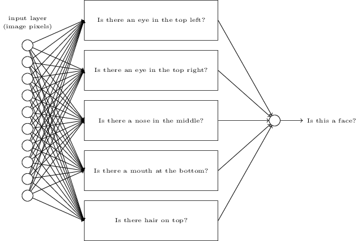

# 第1章 使用神经网络识别手写数字

神经网络使用示例来自动推断用于识别手写数字的规则。通过增加训练样本的数量，神经网络可以更多地了解手写，从而提高其准确性。

我们将开发许多关于神经网络的关键思想，包括两种重要类型的人工神经元（感知器和 sigmoid 神经元），以及神经网络的标准学习算法，称为随机梯度下降。

## Perceptrons 感知器

`什么是神经网络？`首先，我将解释一种称为感知器的人工神经元。感知器是由科学家 弗兰克罗森布拉特 在 20世纪50年代和60年代 开发的 ，受到 沃伦麦卡洛克 和 沃尔特皮茨 的早期工作的启发。

`那么感知器如何工作呢？`


## Sigmoid neurons Sigmoid神经​​元

`如何为神经网络设计算法呢？`


如果权重（或偏差）的微小变化确实导致输出的变化很小，那么我们可以使用这个事实来修改权重和偏差，以使我们的网络以我们想要的方式表现得更好。然后我们重复这一点，一遍又一遍地改变权重和偏差，以产生更好和更好的输出。神经元网络就可以学习。

Sigmoid 神经​​元类似于感知器，但经过修改，其权重和偏差的微小变化仅导致其输出的微小变化。这是 Sigmoid 神经元网络能够学习的关键事实。


## The architecture of neural networks 体系结构


神经网络一层的输出用作下一层的输入。这种网络称为前馈神经网络。

## A simple network to classify handwritten digits 手写数字分类网络


网络的输入层包含28×28=784个神经元。

网络的隐藏层包含15个神经元。

网络的输出层包含10个神经元。

## Learning with gradient descent 梯度下降

`神经网络如何学会识别数字呢？`我们需要的第一件事是训练数据集。

MNIST数据分为两部分。第一部分包含60,000个图像用作训练数据。MNIST数据集的第二部分是10,000个图像，用作测试数据。

x 表示训练样本输入。y=y(x)表示目标输出，为了量化我们实现这一目标的程度，我们定义了成本函数: 


其中，w表示所有权重的集合，b 表示所有的偏差，n是训练样本的总数，a是输入为x时的网络输出。

因此，我们的训练算法的目标是找到一组权重和偏差，使得成本函数 C(w,b) 尽可能小。


解决问题的一种方法是使用微积分来试图找到最小的分析。但神经网络有依赖于数十亿重量和偏差的一个极其复杂的方式成本函数。使用微积分来最小化就行不通！

我们想象一个球从山谷的斜坡上滚下来。我们的日常经验告诉我们，球最终会滚到山谷的底部。微积分告诉我们：


当我们选择  Δv=−η∇C时，有ΔC≈−η∇C⋅∇C，所以 ΔC≤0，也就是说 C 逐渐减少


因此，更新 v


梯度下降算法的工作方式是重复计算的梯度∇C，然后向相反方向移动，“落下”山谷的斜坡。我们可以像这样想象它：


`如何应用梯度下降来学习神经网络？`


不幸的是，当输入的训练样本非常多时，这可能花费很长时间，因此学习很缓慢。

随机梯度下降可用于加速学习。小批量样本的成本函数


## Implementing our network to classify digits 数字分类实现

    git clone https://github.com/mnielsen/neural-networks-and-deep-learning.git

```
"""
前馈神经网络的随机梯度下降学习算法的实现模型。
梯度通过反向传播算法计算。
"""
#### 导入相关库
import random # 标准库
import numpy as np # 三方库

class Network(object):

    def __init__(self, sizes):
        """
        sizes=[2, 3, 1]表示第一层2个神经元，第二层3个神经元，第三层1个神经元。
        偏差和权重使用Gaussian分布(0,1)的随机初始化。
        第一层没有偏差。
        """
        self.num_layers = len(sizes)
        self.sizes = sizes
        self.biases = [np.random.randn(y, 1) for y in sizes[1:]]
        self.weights = [np.random.randn(y, x)
                        for x, y in zip(sizes[:-1], sizes[1:])]

    def feedforward(self, a):
        """前馈"""
        for b, w in zip(self.biases, self.weights):
            a = sigmoid(np.dot(w, a)+b)
        return a

    def SGD(self, training_data, epochs, mini_batch_size, eta,test_data=None):
        """
        使用小批量随机梯度下降算法训练神经网络。
        training_data=[(x, y)]
        test_data定义时，先evaluate再print。
        """
        if test_data: n_test = len(test_data)
        n = len(training_data)
        # 更新所有小批量样本为一次演练
        for j in xrange(epochs):
            random.shuffle(training_data)
            mini_batches = [training_data[k:k+mini_batch_size] for k in xrange(0, n, mini_batch_size)]
            for mini_batch in mini_batches:
                self.update_mini_batch(mini_batch, eta)  
            if test_data:
                print "Epoch {0}: {1} / {2}".format(j, self.evaluate(test_data), n_test)
            else:
                print "Epoch {0} complete".format(j)

    def update_mini_batch(self, mini_batch, eta):
        """
        使用反向传播算法实现的梯度下降来更新小批量样本的权重和偏差。
        mini_batch=[(x, y)]，eta 是学习率
        """
        nabla_b = [np.zeros(b.shape) for b in self.biases]
        nabla_w = [np.zeros(w.shape) for w in self.weights]
        for x, y in mini_batch:
            delta_nabla_b, delta_nabla_w = self.backprop(x, y)  # 主要工作都是这行做的
            nabla_b = [nb+dnb for nb, dnb in zip(nabla_b, delta_nabla_b)]
            nabla_w = [nw+dnw for nw, dnw in zip(nabla_w, delta_nabla_w)]
        self.weights = [w-(eta/len(mini_batch))*nw for w, nw in zip(self.weights, nabla_w)]
        self.biases = [b-(eta/len(mini_batch))*nb for b, nb in zip(self.biases, nabla_b)]

    def backprop(self, x, y):
        """返回 (nabla_b, nabla_w) 作为成本函数 C_x 的梯度"""
        nabla_b = [np.zeros(b.shape) for b in self.biases]
        nabla_w = [np.zeros(w.shape) for w in self.weights]
        # feedforward 前馈
        activation = x
        activations = [x] # 逐层存储激活函数
        zs = [] # 逐层存储 z 向量
        for b, w in zip(self.biases, self.weights):
            z = np.dot(w, activation)+b
            zs.append(z)
            activation = sigmoid(z)
            activations.append(activation)
        # backward pass 反向传递（从最后开始）
        delta = self.cost_derivative(activations[-1], y) * sigmoid_prime(zs[-1])
        nabla_b[-1] = delta
        nabla_w[-1] = np.dot(delta, activations[-2].transpose())
        # l = 1 最后一层，l = 2 倒数第二层，等等。
        for l in xrange(2, self.num_layers):
            z = zs[-l]
            sp = sigmoid_prime(z)
            delta = np.dot(self.weights[-l+1].transpose(), delta) * sp
            nabla_b[-l] = delta
            nabla_w[-l] = np.dot(delta, activations[-l-1].transpose())
        return (nabla_b, nabla_w)

    def evaluate(self, test_data):
        """返回测试样本的正确输出数量"""
        test_results = [(np.argmax(self.feedforward(x)), y) for (x, y) in test_data]
        return sum(int(x == y) for (x, y) in test_results)

    def cost_derivative(self, output_activations, y):
        """返回输出激活函数的偏倒数向量"""
        return (output_activations-y)

#### Miscellaneous functions
def sigmoid(z):
    """The sigmoid function."""
    return 1.0/(1.0+np.exp(-z))

def sigmoid_prime(z):
    """Derivative of the sigmoid function."""
    return sigmoid(z)*(1-sigmoid(z))
```
测试
```
>>> import mnist_loader
>>> training_data, validation_data, test_data = mnist_loader.load_data_wrapper()
>>> import network
>>> net = network.Network([784, 30, 10])
>>> net.SGD(training_data, 30, 10, 3.0, test_data=test_data)
```
设置隐藏层神经元为100，再测试
```
>>> net = network.Network([784, 100, 10])
>>> net.SGD(training_data, 30, 10, 3.0, test_data=test_data)
```
设置 η = 0.001，再测试
```
>>> net = network.Network([784, 100, 10])
>>> net.SGD(training_data, 30, 10, 0.001, test_data=test_data)
```
学习率改为η = 100.0，再测试
```
>>> net = network.Network([784, 30, 10])
>>> net.SGD(training_data, 30, 10, 100.0, test_data=test_data)
```

    sophisticated algorithm ≤ simple learning algorithm + good training data.

## Toward deep learning 深度学习

`我们能做得更好吗？`




具有这种多层结构的网络被称为深度神经网络。

深度学习技术基于随机梯度下降和反向传播，但也引入了新的思路。深度神经网络能够建立复杂的概念层次。