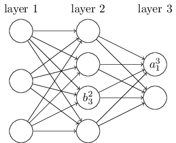
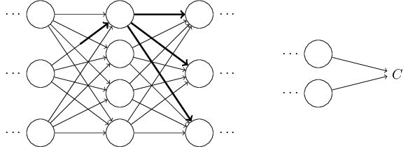

# 第2章 反向传播算法如何工作
反向传播算法最初是在20世纪70年代引入的，但直到1986年，由 David Rumelhart， Geoffrey Hinton和 Ronald Williams 撰写的著名论文才引起了人们的重视。

## 预热





## 两个假设


第一个假设：成本函数 C 可以写成独立样本的成本函数 C_x 的平均值。

第二个假设：成本函数 C 可以写成输出的函数。


## 四个方程

误差定义


## 反向传播算法
```
class Network(object):
    def update_mini_batch(self, mini_batch, eta):
        nabla_b = [np.zeros(b.shape) for b in self.biases]
        nabla_w = [np.zeros(w.shape) for w in self.weights]
        for x, y in mini_batch:
            delta_nabla_b, delta_nabla_w = self.backprop(x, y)
            nabla_b = [nb+dnb for nb, dnb in zip(nabla_b, delta_nabla_b)]
            nabla_w = [nw+dnw for nw, dnw in zip(nabla_w, delta_nabla_w)]
        self.weights = [w-(eta/len(mini_batch))*nw for w, nw in zip(self.weights, nabla_w)]
        self.biases = [b-(eta/len(mini_batch))*nb for b, nb in zip(self.biases, nabla_b)]

   def backprop(self, x, y):
        nabla_b = [np.zeros(b.shape) for b in self.biases]
        nabla_w = [np.zeros(w.shape) for w in self.weights]
        # feedforward
        activation = x
        activations = [x] # list to store all the activations, layer by layer
        zs = [] # list to store all the z vectors, layer by layer
        for b, w in zip(self.biases, self.weights):
            z = np.dot(w, activation)+b
            zs.append(z)
            activation = sigmoid(z)
            activations.append(activation)
        # backward pass
        delta = self.cost_derivative(activations[-1], y) * \
            sigmoid_prime(zs[-1])
        nabla_b[-1] = delta
        nabla_w[-1] = np.dot(delta, activations[-2].transpose())
        for l in xrange(2, self.num_layers):
            z = zs[-l]
            sp = sigmoid_prime(z)
            delta = np.dot(self.weights[-l+1].transpose(), delta) * sp
            nabla_b[-l] = delta
            nabla_w[-l] = np.dot(delta, activations[-l-1].transpose())
        return (nabla_b, nabla_w)

    def cost_derivative(self, output_activations, y):
        return (output_activations-y) 

def sigmoid(z):
    return 1.0/(1.0+np.exp(-z))

def sigmoid_prime(z):
    return sigmoid(z)*(1-sigmoid(z))
```

## 图解





What I've been providing up to now is a heuristic argument, a way of thinking about what's going on when you perturb a weight in a network. Let me sketch out a line of thinking you could use to further develop this argument. First, you could derive explicit expressions for all the individual partial derivatives in Equation (53). That's easy to do with a bit of calculus. Having done that, you could then try to figure out how to write all the sums over indices as matrix multiplications. This turns out to be tedious, and requires some persistence, but not extraordinary insight. After doing all this, and then simplifying as much as possible, what you discover is that you end up with exactly the backpropagation algorithm! And so you can think of the backpropagation algorithm as providing a way of computing the sum over the rate factor for all these paths. Or, to put it slightly differently, the backpropagation algorithm is a clever way of keeping track of small perturbations to the weights (and biases) as they propagate through the network, reach the output, and then affect the cost.

Now, I'm not going to work through all this here. It's messy and requires considerable care to work through all the details. If you're up for a challenge, you may enjoy attempting it. And even if not, I hope this line of thinking gives you some insight into what backpropagation is accomplishing.

What about the other mystery - how backpropagation could have been discovered in the first place? In fact, if you follow the approach I just sketched you will discover a proof of backpropagation. Unfortunately, the proof is quite a bit longer and more complicated than the one I described earlier in this chapter. So how was that short (but more mysterious) proof discovered? What you find when you write out all the details of the long proof is that, after the fact, there are several obvious simplifications staring you in the face. You make those simplifications, get a shorter proof, and write that out. And then several more obvious simplifications jump out at you. So you repeat again. The result after a few iterations is the proof we saw earlier - short, but somewhat obscure, because all the signposts to its construction have been removed! I am, of course, asking you to trust me on this, but there really is no great mystery to the origin of the earlier proof. It's just a lot of hard work simplifying the proof I've sketched in this section.

